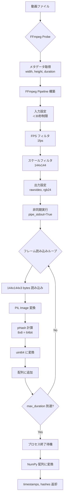

# フィンガープリント生成プロセス

## 処理フロー



## pHash 計算詳細


## ハッシュの特性

### エンコード耐性

| 変更内容 | ハミング距離 | 検出可能性 |
|---------|-------------|-----------|
| 解像度変更 (1080p→720p) | 0-5 | ✅ 高 |
| 再圧縮 (H.264→H.265) | 0-8 | ✅ 高 |
| 色調補正 | 3-10 | ✅ 中 |
| クロッピング (空間) | 20+ | ❌ 低 |
| シーン編集 | 30+ | ❌ 不可 |

### パフォーマンス

```python
# 1フレームあたりの処理時間
- FFmpeg デコード: ~50ms
- pHash 計算: ~10ms
- 合計: ~60ms/frame

# 30秒動画 (30フレーム @ 1fps)
- 理論値: 30 * 60ms = 1.8秒
- 実測値: ~4秒 (ネットワーク・I/O含む)
```

## コード例

```python
# miru/fingerprint.py の核心部分
def generate_fingerprints(file_path, fps=1.0, max_duration=30.0):
    # FFmpeg パイプライン
    input_stream = ffmpeg.input(file_path, t=max_duration)
    process = (
        input_stream
        .filter('fps', fps=fps)
        .filter('scale', 144, 144)
        .output('pipe:', format='rawvideo', pix_fmt='rgb24')
        .run_async(pipe_stdout=True)
    )
    
    # フレーム処理ループ
    hashes = []
    timestamps = []
    frame_idx = 0
    
    while True:
        in_bytes = process.stdout.read(144 * 144 * 3)
        if not in_bytes:
            break
            
        image = Image.frombytes('RGB', (144, 144), in_bytes)
        h = imagehash.phash(image, hash_size=8)
        hash_val = int(str(h), 16)  # 64bit整数に変換
        
        hashes.append(hash_val)
        timestamps.append(frame_idx / fps)
        frame_idx += 1
    
    return np.array(timestamps), np.array(hashes, dtype=np.uint64)
```
