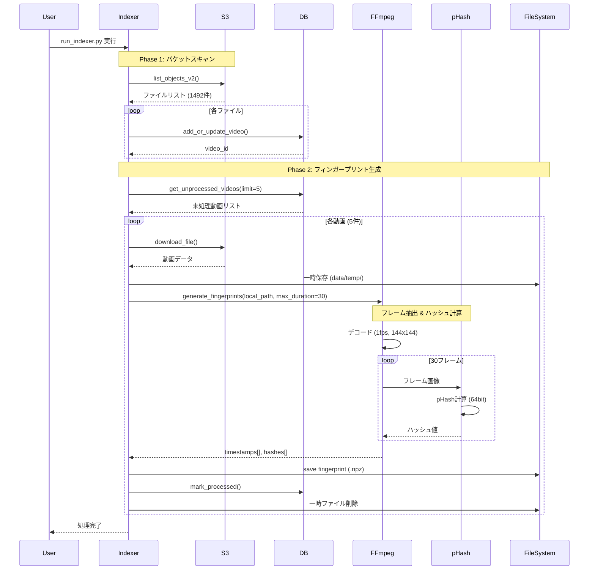

# インデックス処理シーケンス

## 処理フロー



## 処理時間

| フェーズ | 処理時間 | 備考 |
|---------|---------|------|
| バケットスキャン | ~30秒 | 1492件の場合 |
| 1動画あたりの処理 | ~4秒 | 30秒分のフィンガープリント生成 |
| 5動画の処理 | ~20秒 | 並列化で高速化可能 |

## データ保存形式

### SQLite (miru.db)

```sql
CREATE TABLE videos (
    id INTEGER PRIMARY KEY,
    s3_key TEXT UNIQUE,
    size INTEGER,
    last_modified TEXT,
    duration REAL,
    processed_at TEXT,
    fingerprint_path TEXT
);
```

### Fingerprint Files (.npz)

```python
{
    'timestamps': np.array([0.0, 1.0, 2.0, ..., 29.0], dtype=float32),
    'hashes': np.array([0x1a2b3c4d5e6f7890, ...], dtype=uint64)
}
```
