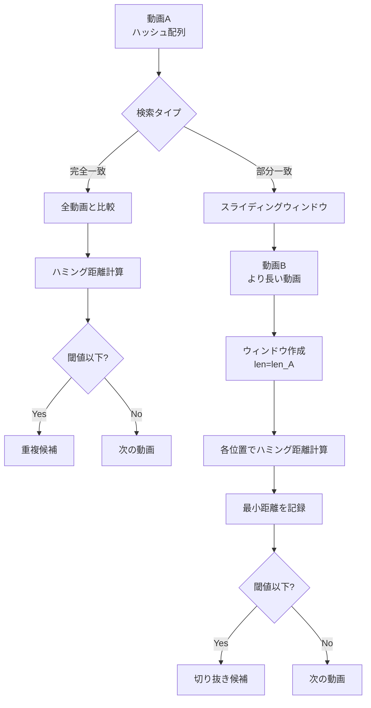
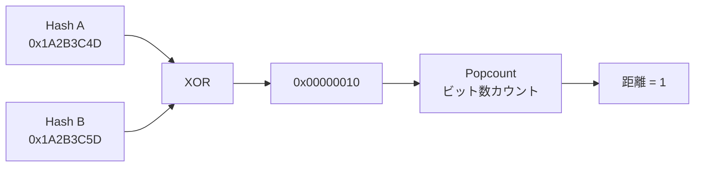
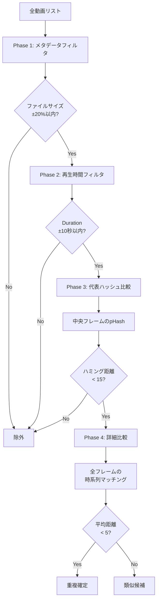

# 類似性検索アルゴリズム

## アルゴリズム概要



## ハミング距離計算

### 基本原理



### NumPy による高速化

```python
# miru/algo.py の核心アルゴリズム

def find_subsequence_match(haystack, needle, threshold=10.0):
    """
    haystack: 長い動画のハッシュ配列 (N個)
    needle: 短い動画のハッシュ配列 (M個)
    threshold: 平均ハミング距離の閾値
    """
    n_needle = len(needle)
    n_haystack = len(haystack)
    
    # スライディングウィンドウの作成
    strides = haystack.strides[0]
    windows = np.lib.stride_tricks.as_strided(
        haystack,
        shape=(n_haystack - n_needle + 1, n_needle),
        strides=(strides, strides)
    )
    # windows.shape = (N-M+1, M)
    
    # XOR でビット差分を計算
    xor_matrix = np.bitwise_xor(windows, needle)
    # xor_matrix.shape = (N-M+1, M)
    
    # Popcount (ビット数カウント) - ビットハック使用
    x = xor_matrix
    x = (x & 0x5555555555555555) + ((x >> 1) & 0x5555555555555555)
    x = (x & 0x3333333333333333) + ((x >> 2) & 0x3333333333333333)
    x = (x & 0x0f0f0f0f0f0f0f0f) + ((x >> 4) & 0x0f0f0f0f0f0f0f0f)
    x = (x & 0x00ff00ff00ff00ff) + ((x >> 8) & 0x00ff00ff00ff00ff)
    x = (x & 0x0000ffff0000ffff) + ((x >> 16) & 0x0000ffff0000ffff)
    x = (x & 0x00000000ffffffff) + ((x >> 32) & 0x00000000ffffffff)
    
    # 各ウィンドウの合計距離
    window_distances = x.sum(axis=1)  # shape: (N-M+1,)
    
    # 平均距離を計算
    avg_distances = window_distances / n_needle
    
    # 最小値を見つける
    best_idx = np.argmin(avg_distances)
    min_dist = avg_distances[best_idx]
    
    return min_dist < threshold, best_idx, min_dist
```

## 計算量

### 全ペア比較 (Naive)

```
時間計算量: O(N²)
N = 1492件の場合:
  比較回数 = 1492 * 1491 / 2 ≈ 1,112,000回
```

### スライディングウィンドウ

```
時間計算量: O(N * M)
N = haystack長, M = needle長

例: 10分動画 (600フレーム) vs 1分動画 (60フレーム)
  比較回数 = (600 - 60 + 1) * 60 = 32,460回
```

### Vector DB 使用時 (将来実装)

```
時間計算量: O(N log N)
N = 1492件の場合:
  比較回数 ≈ 1492 * log₂(1492) ≈ 15,000回
  
高速化率: 1,112,000 / 15,000 ≈ 74倍
```

## 検索戦略



## 閾値設定

| 判定 | 平均ハミング距離 | 用途 |
|------|-----------------|------|
| 完全一致 | 0-2 | 同一ファイル検出 |
| ほぼ同一 | 3-5 | 再エンコード検出 |
| 類似 | 6-10 | 画質劣化版検出 |
| 疑わしい | 11-15 | 手動確認推奨 |
| 非類似 | 16+ | 別動画 |
