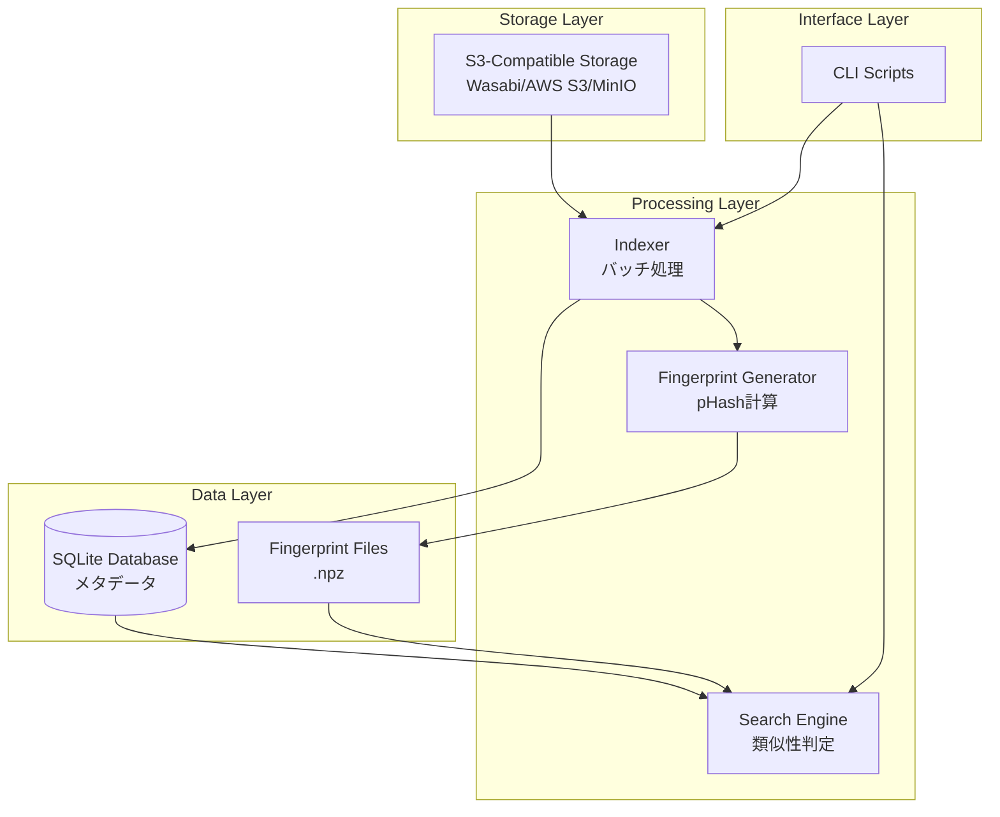
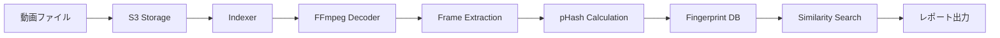

# システムアーキテクチャ

## 概要

Miruは、S3互換ストレージ上の大量の動画から重複・類似・切り抜き動画を検出するシステムです。

## コンポーネント構成

## データフロー

## 技術スタック

| レイヤー | 技術 |
|---------|------|
| 言語 | Python 3.14 |
| ストレージ | S3-Compatible (boto3) |
| 動画処理 | FFmpeg, opencv-python |
| ハッシュ計算 | imagehash (pHash) |
| データベース | SQLite |
| 数値計算 | NumPy, SciPy |
| 検索アルゴリズム | カスタム実装（ハミング距離ベース） |
