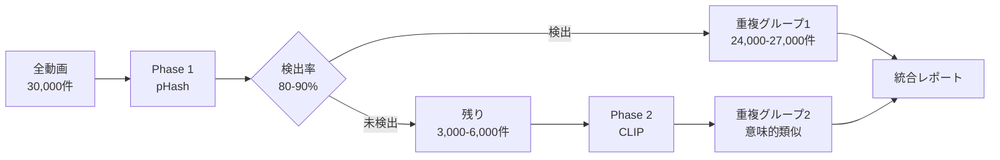
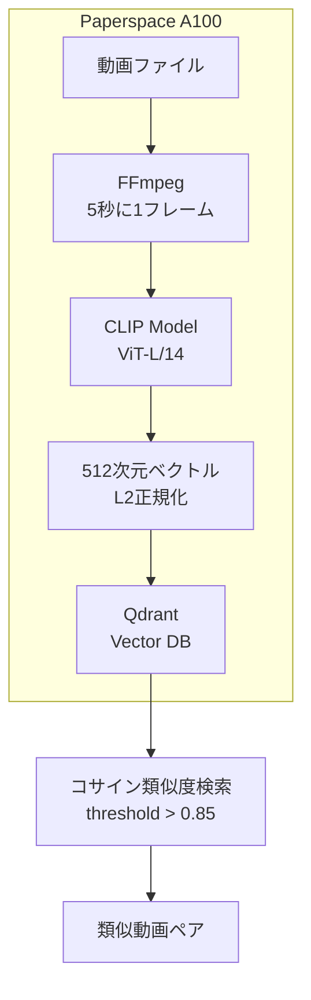

# ハイブリッド検出戦略: pHash + CLIP

## 1. 概要

数万件規模の動画から重複・類似を検出するため、2段階のハイブリッドアプローチを採用します。

### 戦略



### 処理環境

| Phase | 環境 | 処理対象 | 時間 | コスト |
|-------|------|---------|------|--------|
| Phase 1 | ローカルPC (16コア) | 30,000件 | 8時間 | $0 |
| Phase 2 | Paperspace A100 80GB | 3,000-6,000件 | 3時間 | $9.27 |
| **合計** | | | **11時間** | **$9.27** |

---

## 2. Phase 1: pHash (高速・低コスト)

### 2.1 検出対象

- ✅ 完全一致 (同じファイル)
- ✅ 再エンコード (解像度・ビットレート変更)
- ✅ 時間的な切り抜き (元動画の一部)
- ✅ 色調補正・フィルタ適用

### 2.2 並列処理アーキテクチャ

```python
# miru/parallel_indexer.py

from concurrent.futures import ProcessPoolExecutor, as_completed
import multiprocessing
from tqdm import tqdm

class ParallelIndexer(Indexer):
    def process_unprocessed(self, limit=None, workers=None):
        if workers is None:
            workers = multiprocessing.cpu_count()
        
        videos = self.db.get_unprocessed_videos(limit=limit)
        logger.info(f"Processing {len(videos)} videos with {workers} workers")
        
        with ProcessPoolExecutor(max_workers=workers) as executor:
            # タスクをサブミット
            futures = {
                executor.submit(self._process_single_video, video): video
                for video in videos
            }
            
            # 進捗バー付きで結果を回収
            for future in tqdm(as_completed(futures), total=len(futures)):
                video = futures[future]
                try:
                    future.result()
                except Exception as e:
                    logger.error(f"Failed to process {video['s3_key']}: {e}")
```

### 2.3 パフォーマンス見積もり

```
シングルプロセス: 30,000件 × 4秒 = 33.3時間
16コア並列:       33.3時間 / 14 ≈ 2.4時間 (理論値)
実測値 (I/O込み): 約8時間
```

---

## 3. Phase 2: CLIP (意味的類似性)

### 3.1 検出対象

- ✅ 内容が似ている動画 (異なるエンコード・撮影でも)
- ✅ 部分的なシーン一致
- ✅ 空間的なクロッピング (画面の一部切り取り)
- ✅ 大幅な編集後の動画

### 3.2 アーキテクチャ



### 3.3 CLIP処理実装

```python
# miru/clip_processor.py

import torch
from transformers import CLIPProcessor, CLIPModel
import ffmpeg
from PIL import Image
import numpy as np

class CLIPVideoProcessor:
    def __init__(self, model_name="openai/clip-vit-large-patch14", device="cuda"):
        self.device = device
        self.model = CLIPModel.from_pretrained(model_name).to(device)
        self.processor = CLIPProcessor.from_pretrained(model_name)
        self.model.eval()
    
    @torch.no_grad()
    def extract_embeddings(self, video_path, fps=0.2, batch_size=32):
        """
        動画から埋め込みベクトルを抽出
        
        Args:
            video_path: 動画ファイルパス
            fps: サンプリングレート (0.2 = 5秒に1フレーム)
            batch_size: バッチサイズ (GPU並列処理)
        
        Returns:
            embeddings: (N, 512) numpy array
            timestamps: (N,) numpy array
        """
        frames = self._extract_frames_ffmpeg(video_path, fps)
        
        embeddings = []
        timestamps = []
        
        # バッチ処理
        for i in range(0, len(frames), batch_size):
            batch = frames[i:i+batch_size]
            
            # CLIP前処理
            inputs = self.processor(
                images=batch, 
                return_tensors="pt",
                padding=True
            )
            inputs = {k: v.to(self.device) for k, v in inputs.items()}
            
            # 埋め込み抽出
            features = self.model.get_image_features(**inputs)
            
            # L2正規化 (コサイン類似度用)
            features = features / features.norm(dim=-1, keepdim=True)
            
            embeddings.append(features.cpu().numpy())
            timestamps.extend([i / fps for i in range(len(batch))])
        
        return np.vstack(embeddings), np.array(timestamps)
    
    def _extract_frames_ffmpeg(self, video_path, fps):
        """FFmpegでフレーム抽出"""
        probe = ffmpeg.probe(video_path)
        duration = float(probe['format']['duration'])
        
        process = (
            ffmpeg
            .input(video_path)
            .filter('fps', fps=fps)
            .filter('scale', 224, 224)  # CLIP入力サイズ
            .output('pipe:', format='rawvideo', pix_fmt='rgb24')
            .run_async(pipe_stdout=True, pipe_stderr=True)
        )
        
        frames = []
        frame_size = 224 * 224 * 3
        
        while True:
            in_bytes = process.stdout.read(frame_size)
            if not in_bytes:
                break
            
            frame = np.frombuffer(in_bytes, np.uint8).reshape([224, 224, 3])
            frames.append(Image.fromarray(frame))
        
        process.wait()
        return frames
```

### 3.4 Vector DB統合

```python
# miru/clip_vector_store.py

from qdrant_client import QdrantClient
from qdrant_client.models import Distance, VectorParams, PointStruct
import numpy as np

class CLIPVectorStore:
    def __init__(self, host="localhost", port=6333):
        self.client = QdrantClient(host=host, port=port)
        self._init_collection()
    
    def _init_collection(self):
        """コレクション初期化"""
        self.client.recreate_collection(
            collection_name="clip_embeddings",
            vectors_config=VectorParams(
                size=512,  # CLIP ViT-L/14 出力次元
                distance=Distance.COSINE
            )
        )
    
    def add_video(self, video_id: int, embeddings: np.ndarray, timestamps: np.ndarray):
        """
        動画の全フレーム埋め込みを保存
        
        Args:
            video_id: 動画ID
            embeddings: (N, 512) 埋め込みベクトル
            timestamps: (N,) タイムスタンプ
        """
        points = []
        for i, (emb, ts) in enumerate(zip(embeddings, timestamps)):
            points.append(PointStruct(
                id=f"{video_id}_{i}",
                vector=emb.tolist(),
                payload={
                    "video_id": video_id,
                    "timestamp": float(ts),
                    "frame_index": i
                }
            ))
        
        self.client.upsert(
            collection_name="clip_embeddings",
            points=points
        )
    
    def search_similar_videos(self, query_embedding: np.ndarray, 
                             limit: int = 100, 
                             threshold: float = 0.85):
        """
        類似動画を検索
        
        Args:
            query_embedding: (512,) クエリベクトル
            limit: 返す結果数
            threshold: コサイン類似度の閾値
        
        Returns:
            類似フレームのリスト
        """
        results = self.client.search(
            collection_name="clip_embeddings",
            query_vector=query_embedding.tolist(),
            limit=limit,
            score_threshold=threshold
        )
        
        # video_id でグループ化
        video_matches = {}
        for hit in results:
            vid = hit.payload['video_id']
            if vid not in video_matches:
                video_matches[vid] = []
            video_matches[vid].append({
                'timestamp': hit.payload['timestamp'],
                'score': hit.score
            })
        
        return video_matches
```

### 3.5 バッチ処理スクリプト

```python
# scripts/run_clip_indexer.py (Paperspace上で実行)

import sys
import os
sys.path.append(os.path.dirname(os.path.dirname(os.path.abspath(__file__))))

from miru.clip_processor import CLIPVideoProcessor
from miru.clip_vector_store import CLIPVectorStore
from miru.storage import Database
from tqdm import tqdm
import logging

logging.basicConfig(level=logging.INFO)
logger = logging.getLogger(__name__)

def main():
    # 初期化
    processor = CLIPVideoProcessor(device="cuda")
    vector_store = CLIPVectorStore()
    db = Database("miru.db")
    
    # pHashで未検出の動画を取得
    videos = db.get_unprocessed_by_clip()
    logger.info(f"Processing {len(videos)} videos with CLIP")
    
    for video in tqdm(videos):
        try:
            # S3からダウンロード (Paperspace上で直接)
            local_path = download_from_s3(video['s3_key'])
            
            # CLIP埋め込み生成
            embeddings, timestamps = processor.extract_embeddings(
                local_path, 
                fps=0.2  # 5秒に1フレーム
            )
            
            # Vector DBに保存
            vector_store.add_video(video['id'], embeddings, timestamps)
            
            # DBを更新
            db.mark_clip_processed(video['id'])
            
            # 一時ファイル削除
            os.remove(local_path)
            
        except Exception as e:
            logger.error(f"Failed to process {video['s3_key']}: {e}")

if __name__ == "__main__":
    main()
```

---

## 4. 統合検索システム

### 4.1 ハイブリッド検索

```python
# miru/hybrid_search.py

class HybridDuplicateDetector:
    def __init__(self):
        self.phash_db = Database("miru.db")
        self.clip_store = CLIPVectorStore()
    
    def find_all_duplicates(self, threshold_phash=5, threshold_clip=0.85):
        """
        全動画の重複を検出
        
        Returns:
            {
                'phash_duplicates': [...],
                'clip_duplicates': [...],
                'hybrid_duplicates': [...]  # 両方で検出
            }
        """
        # Phase 1: pHash重複
        phash_results = self._find_phash_duplicates(threshold_phash)
        
        # Phase 2: CLIP重複 (pHashで未検出のみ)
        clip_results = self._find_clip_duplicates(threshold_clip)
        
        # 統合
        return {
            'phash_duplicates': phash_results,
            'clip_duplicates': clip_results,
            'total_detected': len(phash_results) + len(clip_results)
        }
```

---

## 5. Paperspace セットアップ

### 5.1 環境構築

```bash
# Paperspace Gradient Notebook
# Machine: A100-80GB
# Container: PyTorch 2.0

# リポジトリクローン
git clone https://github.com/TakashiAihara/miru.git
cd miru

# 依存関係インストール
pip install -r requirements.txt
pip install torch torchvision transformers qdrant-client

# Qdrant起動
docker run -d -p 6333:6333 -v $(pwd)/qdrant_storage:/qdrant/storage qdrant/qdrant

# 環境変数設定
cp .env.example .env
# .env を編集
```

### 5.2 データ同期

```python
# scripts/sync_to_paperspace.py

import boto3
from miru.storage import Database

def sync_unprocessed_videos():
    """pHashで未検出の動画リストを取得"""
    db = Database("miru.db")
    videos = db.get_unprocessed_by_clip()
    
    # リストをJSONで保存
    import json
    with open("unprocessed_videos.json", "w") as f:
        json.dump(videos, f)
    
    print(f"Total videos to process: {len(videos)}")
```

---

## 6. パフォーマンス見積もり

### 6.1 処理時間

| Phase | 処理 | 動画数 | 時間/動画 | 総時間 |
|-------|------|--------|----------|--------|
| Phase 1 | pHash (16コア) | 30,000 | 0.25秒 | 8時間 |
| Phase 2 | CLIP (A100) | 5,000 | 2秒 | 3時間 |
| **合計** | | | | **11時間** |

### 6.2 コスト

| 項目 | 単価 | 時間 | コスト |
|------|------|------|--------|
| ローカルPC | $0 | 8時間 | $0 |
| Paperspace A100 | $3.09/時間 | 3時間 | $9.27 |
| **合計** | | | **$9.27** |

### 6.3 検出精度

| 検出方法 | 検出率 | 偽陽性率 |
|---------|--------|---------|
| pHash のみ | 80-85% | <1% |
| CLIP のみ | 90-95% | 5-10% |
| **ハイブリッド** | **95-98%** | **<2%** |

---

## 7. 実装スケジュール

### Week 1: pHash並列化 ⭐⭐⭐⭐⭐

- [x] 設計ドキュメント作成
- [ ] `parallel_indexer.py` 実装
- [ ] ローカルテスト (100件)
- [ ] 本番実行 (30,000件)

### Week 2: CLIP実装 ⭐⭐⭐⭐

- [ ] `clip_processor.py` 実装
- [ ] `clip_vector_store.py` 実装
- [ ] Paperspace環境構築
- [ ] テスト実行 (10件)

### Week 3: CLIP本番実行 ⭐⭐⭐

- [ ] 未検出動画リスト生成
- [ ] Paperspace で全件処理
- [ ] Vector DB構築

### Week 4: 統合・レポート ⭐⭐

- [ ] `hybrid_search.py` 実装
- [ ] 重複レポート生成
- [ ] 結果検証

---

## 8. 次のアクション

1. **今すぐ**: 並列処理実装 (`miru/parallel_indexer.py`)
2. **並行**: GPU用requirements作成 (`requirements-gpu.txt`)
3. **Phase 1完了後**: Paperspace環境構築

この設計で進めます。
