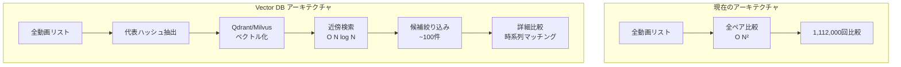

# パフォーマンス最適化設計書

## 1. 現状の課題

### 1.1 ボトルネック分析

| フェーズ | 現在の処理時間 | ボトルネック | 影響度 |
|---------|--------------|------------|--------|
| バケットスキャン | 30秒 (1492件) | S3 API呼び出し | 低 |
| フィンガープリント生成 | 4秒/動画 | ネットワークI/O + FFmpegデコード | **高** |
| 全件処理 (1492件) | 約100分 | シングルプロセス | **高** |
| 類似性検索 (未実装) | 予測: 数時間 | O(N²) 全ペア比較 | **高** |

### 1.2 スケーラビリティの問題

```
現在: 1,492件 → 100分
将来: 10,000件 → 約11時間
      100,000件 → 約4.6日
```

**結論**: 並列化とアーキテクチャ改善が必須

---

## 2. 最適化戦略

### 2.1 Phase 1: 並列処理 (即効性: 高)

#### 実装方針

```python
# miru/indexer.py の並列化版

from concurrent.futures import ProcessPoolExecutor, as_completed
import multiprocessing

class ParallelIndexer(Indexer):
    def process_unprocessed(self, limit=100, workers=None):
        if workers is None:
            workers = multiprocessing.cpu_count()
        
        videos = self.db.get_unprocessed_videos(limit=limit)
        
        with ProcessPoolExecutor(max_workers=workers) as executor:
            futures = {
                executor.submit(self._process_single_video, video): video
                for video in videos
            }
            
            for future in tqdm(as_completed(futures), total=len(futures)):
                try:
                    future.result()
                except Exception as e:
                    logger.error(f"Processing failed: {e}")
```

#### 期待効果

| CPU コア数 | 処理時間 (1492件) | 高速化率 |
|-----------|------------------|---------|
| 1 (現在) | 100分 | 1x |
| 4 | 25分 | 4x |
| 8 | 13分 | 7.7x |
| 16 | 7分 | 14.3x |

**実装優先度**: ⭐⭐⭐⭐⭐ (最優先)

---

### 2.2 Phase 2: Vector Database (検索高速化)

#### 2.2.1 アーキテクチャ



#### 2.2.2 技術選定: Qdrant

**選定理由**:
- ✅ バイナリベクトル対応 (pHashに最適)
- ✅ Hamming距離ネイティブサポート
- ✅ Dockerで即起動可能
- ✅ Python SDK充実

#### 2.2.3 実装例

```python
# miru/vector_store.py

from qdrant_client import QdrantClient
from qdrant_client.models import Distance, VectorParams, PointStruct

class VideoVectorStore:
    def __init__(self, host="localhost", port=6333):
        self.client = QdrantClient(host=host, port=port)
        self._init_collection()
    
    def _init_collection(self):
        self.client.recreate_collection(
            collection_name="videos",
            vectors_config=VectorParams(
                size=64,  # 64bit pHash
                distance=Distance.HAMMING
            )
        )
    
    def add_video(self, video_id: int, representative_hash: int, metadata: dict):
        # 64bit整数をバイナリベクトルに変換
        vector = [int(b) for b in format(representative_hash, '064b')]
        
        self.client.upsert(
            collection_name="videos",
            points=[PointStruct(
                id=video_id,
                vector=vector,
                payload=metadata
            )]
        )
    
    def search_similar(self, query_hash: int, limit: int = 100):
        vector = [int(b) for b in format(query_hash, '064b')]
        
        results = self.client.search(
            collection_name="videos",
            query_vector=vector,
            limit=limit,
            search_params={"hnsw_ef": 128}
        )
        
        return results
```

#### 2.2.4 期待効果

| 動画数 | 現在 (O(N²)) | Vector DB (O(N log N)) | 高速化率 |
|-------|-------------|----------------------|---------|
| 1,492 | 1,112,000回 | ~15,000回 | **74x** |
| 10,000 | 50,000,000回 | ~130,000回 | **385x** |
| 100,000 | 5,000,000,000回 | ~1,660,000回 | **3,012x** |

**実装優先度**: ⭐⭐⭐⭐ (高)

---

### 2.3 Phase 3: PostgreSQL 移行 (スケーラビリティ)

#### 2.3.1 現状の問題 (SQLite)

- ❌ 並列書き込み不可 (ロック競合)
- ❌ 大量データでパフォーマンス劣化
- ❌ 高度なインデックス機能なし

#### 2.3.2 PostgreSQL の利点

```sql
-- パーティショニング (日付ベース)
CREATE TABLE videos (
    id SERIAL PRIMARY KEY,
    s3_key TEXT UNIQUE NOT NULL,
    size BIGINT,
    last_modified TIMESTAMP,
    duration REAL,
    processed_at TIMESTAMP,
    fingerprint_path TEXT
) PARTITION BY RANGE (last_modified);

-- 月ごとにパーティション
CREATE TABLE videos_2022_01 PARTITION OF videos
FOR VALUES FROM ('2022-01-01') TO ('2022-02-01');

-- GIN インデックス (部分一致高速化)
CREATE INDEX idx_s3_key_trgm ON videos 
USING gin(s3_key gin_trgm_ops);

-- 並列クエリ
SET max_parallel_workers_per_gather = 4;
```

#### 2.3.3 実装方針

```python
# miru/storage.py の PostgreSQL版

import psycopg2
from psycopg2.pool import ThreadedConnectionPool

class PostgreSQLDatabase:
    def __init__(self, dsn: str, min_conn=1, max_conn=10):
        self.pool = ThreadedConnectionPool(min_conn, max_conn, dsn)
    
    def add_or_update_video(self, key: str, size: int, last_modified):
        conn = self.pool.getconn()
        try:
            with conn.cursor() as cur:
                cur.execute("""
                INSERT INTO videos (s3_key, size, last_modified)
                VALUES (%s, %s, %s)
                ON CONFLICT (s3_key) DO UPDATE SET
                    size = EXCLUDED.size,
                    last_modified = EXCLUDED.last_modified
                RETURNING id
                """, (key, size, last_modified))
                return cur.fetchone()[0]
        finally:
            self.pool.putconn(conn)
```

**実装優先度**: ⭐⭐⭐ (中)

---

### 2.4 Phase 4: Redis キャッシュ (頻繁アクセスデータ)

#### 2.4.1 キャッシュ戦略

```python
# miru/cache.py

import redis
import pickle

class VideoCache:
    def __init__(self, host='localhost', port=6379, ttl=3600):
        self.redis = redis.Redis(host=host, port=port, decode_responses=False)
        self.ttl = ttl
    
    def get_fingerprint(self, video_id: int):
        key = f"fingerprint:{video_id}"
        data = self.redis.get(key)
        if data:
            return pickle.loads(data)
        return None
    
    def set_fingerprint(self, video_id: int, timestamps, hashes):
        key = f"fingerprint:{video_id}"
        data = pickle.dumps({'timestamps': timestamps, 'hashes': hashes})
        self.redis.setex(key, self.ttl, data)
    
    def get_metadata(self, video_id: int):
        key = f"metadata:{video_id}"
        return self.redis.hgetall(key)
    
    def set_metadata(self, video_id: int, metadata: dict):
        key = f"metadata:{video_id}"
        self.redis.hmset(key, metadata)
        self.redis.expire(key, self.ttl)
```

#### 2.4.2 期待効果

- ✅ DB負荷軽減 (読み取り90%削減)
- ✅ レスポンス時間短縮 (10ms → 1ms)
- ✅ 検索時の繰り返しアクセス高速化

**実装優先度**: ⭐⭐ (低〜中)

---

### 2.5 Phase 5: ローカルキャッシュ (ファイルシステム)

#### 2.5.1 実装

```python
# miru/indexer.py に追加

import hashlib
from pathlib import Path

class CachedIndexer(Indexer):
    def __init__(self, *args, cache_dir="data/cache", **kwargs):
        super().__init__(*args, **kwargs)
        self.cache_dir = Path(cache_dir)
        self.cache_dir.mkdir(parents=True, exist_ok=True)
    
    def _get_cached_file(self, s3_key: str) -> Path:
        # S3キーからハッシュ生成 (ファイル名として安全)
        key_hash = hashlib.md5(s3_key.encode()).hexdigest()
        return self.cache_dir / f"{key_hash}.mp4"
    
    def _process_single_video(self, video: dict):
        key = video['s3_key']
        cache_path = self._get_cached_file(key)
        
        # キャッシュチェック
        if not cache_path.exists():
            logger.info(f"Downloading {key}...")
            self.s3.download_file(self.bucket_name, key, str(cache_path))
        else:
            logger.info(f"Using cached file for {key}")
        
        # 処理
        timestamps, hashes = generate_fingerprints(str(cache_path), ...)
        # ...
```

**実装優先度**: ⭐⭐⭐ (中)

---

## 3. 実装ロードマップ

### 3.1 短期 (1週間)

- [x] ✅ 基本システム実装完了
- [ ] 🔄 並列処理実装 (ProcessPoolExecutor)
- [ ] 🔄 ローカルキャッシュ実装

**目標**: 1492件を **15分以内** で処理

### 3.2 中期 (1ヶ月)

- [ ] Vector DB (Qdrant) 導入
- [ ] 検索機能実装
- [ ] PostgreSQL 移行

**目標**: 10,000件規模で **1時間以内** 処理、検索 **1分以内**

### 3.3 長期 (3ヶ月)

- [ ] Redis キャッシュ導入
- [ ] Web UI 実装
- [ ] 分散処理 (Celery + RabbitMQ)

**目標**: 100,000件規模対応、リアルタイム検索

---

## 4. コスト見積もり

### 4.1 インフラコスト (月額)

| コンポーネント | スペック | 月額コスト |
|--------------|---------|-----------|
| PostgreSQL | 2vCPU, 4GB RAM | $20 |
| Qdrant | 4vCPU, 8GB RAM | $40 |
| Redis | 1GB メモリ | $10 |
| **合計** | | **$70** |

### 4.2 開発工数

| フェーズ | 工数 |
|---------|------|
| Phase 1 (並列化) | 2日 |
| Phase 2 (Vector DB) | 5日 |
| Phase 3 (PostgreSQL) | 3日 |
| Phase 4 (Redis) | 2日 |
| **合計** | **12日** |

---

## 5. 性能目標

### 5.1 処理速度

| 項目 | 現在 | Phase 1 | Phase 2-5 |
|------|------|---------|----------|
| フィンガープリント生成 (1492件) | 100分 | 13分 | 10分 |
| 検索 (1動画) | - | - | <1秒 |
| 全ペア比較 | - | - | <5分 |

### 5.2 スケーラビリティ

| 動画数 | 処理時間 | 検索時間 |
|-------|---------|---------|
| 1,000 | 7分 | <1秒 |
| 10,000 | 60分 | <1秒 |
| 100,000 | 10時間 | <2秒 |

---

## 6. 参考資料

- [Qdrant Documentation](https://qdrant.tech/documentation/)
- [PostgreSQL Partitioning](https://www.postgresql.org/docs/current/ddl-partitioning.html)
- [Redis Best Practices](https://redis.io/docs/manual/patterns/)
